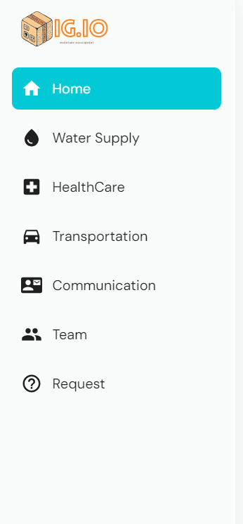

# Inventory Management System





## Table of Contents
- [Overview](#overview)
- [Home](#home)
- [Tech Stack](#tech-stack)
- [API Keys](#api-keys)
- [Screenshots](#screenshots)
- [Getting Started](#getting-started)
- [Installation](#installation)
- [Usage](#usage)
- [License](#license)

## Overview
The Inventory Management System for Indore City is designed to streamline the management of various municipal services including Water Supply, Healthcare, and Transportation. The system provides real-time updates on activities, notifications, and performance metrics.

## Home
The home page displays the following sections:

### Activities & Notifications
- Displays recent activities and notifications related to the inventory system.

### Assets Performance
- Shows the performance metrics of various assets managed by the system.

### Water Supply Services in Indore
- Provides information and updates about the water supply services.

### Health Care Services in Indore
- Shows details and notifications about healthcare services.

### Transportation Services in Indore
- Provides updates and performance metrics for transportation services in the city.

## Tech Stack
The project is built using the following technologies:
1. ReactJS
2. Next.js
3. API data
4. Plotly
5. Django
6. Django REST framework
7. Flask
8. FastAPI

## API Keys
For accessing various services, the following API keys are used:
- [API Key 1](https://ab87-115-245-99-238.ngrok-free.app)
- [API Key 2](https://ab87-115-245-99-238.ngrok-free.app)


## Getting Started
To get a local copy up and running follow these simple steps.

### Prerequisites
- Node.js
- Python

### Installation

1. Clone the repo
   ```sh
   git clone  https://github.com/darshansharma19/Hack-Ndore


2. Vercel Deploy 
 ```sh
    https://hack-ndore.vercel.app/
